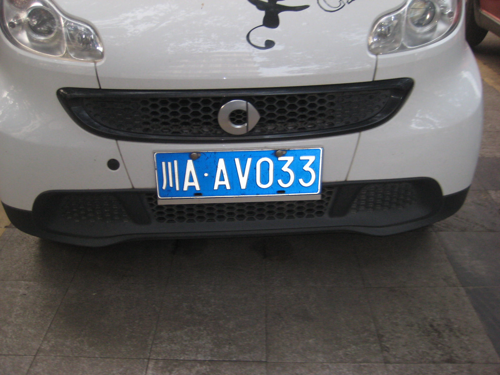
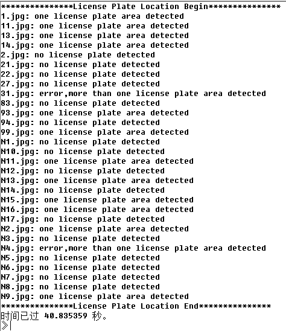
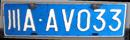
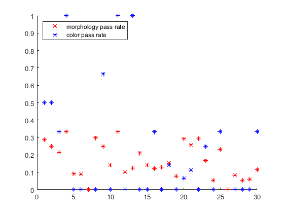
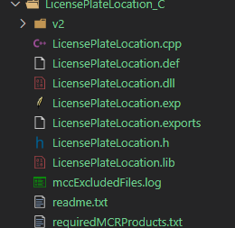
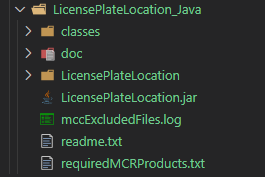

基于传统图像处理方法实现了车牌识别定位，并将其封装成了C++动态库以及Java的jar包，可供其他语言使用，需要安装Matlab Runtime 9.5。下面对其进行效果简要说明：

- 输入图像



- 检测结果







- DLL使用
  - 由于编译出的DLL文件过大，已上传至[Google Dreive](https://drive.google.com/drive/folders/1lwluMv2MD0fBsXeYWBBUkPLSeSSyg9GZ?usp=sharing)
  - 调用方式参照[UlovHer/CppCallMtlab: Use Cpp to call matlab functions. (github.com)](https://github.com/UlovHer/CppCallMtlab)

```shell
# 编译成DLL命令
mkdir LicensePlateLocation_C
mcc -W cpplib:'LicensePlateLocation,all' -T link:lib license_plate_location.m plate_location_kelnel.m minboundrect.m rgb2hsi.m rectify.m detection_color.m -d LicensePlateLocation_Java
```



- Jar使用
  - 由于编译出的Jar文件过大，已上传至[Google Dreive](https://drive.google.com/drive/folders/18x4S4lrFClVKdPlyKVvfbpx65bAi5T8J?usp=sharing)
  - 调用方式参照[UlovHer/JavaCallMatlab: Compile matlab functions into jar and call matlab functions in java. (github.com)](https://github.com/UlovHer/JavaCallMatlab)

```shell
# 编译成Jar包命令
mkdir LicensePlateLocation_Java
mcc -W 'java:LicensePlateLocation,LicensePlateLocation' license_plate_location.m plate_location_kelnel.m minboundrect.m rgb2hsi.m rectify.m detection_color.m -d LicensePlateLocation_Java
The output directory
```



